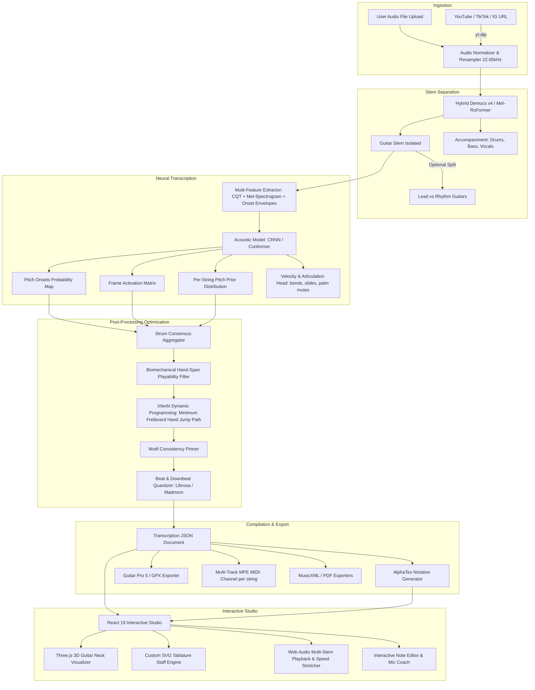

# DeepFret Next — Architecture & Algorithmic Design

This document details the mathematical, acoustic, and computational foundations of **DeepFret Next**, comparing the original system to our improved architecture.

---

## 1. System Architecture Overview

---

## 2. The Guitar Tablature Assignment Problem

### The Ambiguity
A single musical note with fundamental frequency $f_0$ (pitch $p \in [40, 88]$ in MIDI numbers, where $E_2=40$ and $E_6=88$) can appear at multiple $(s, f)$ coordinates on a 6-string guitar:
$$p = T_s + f$$
where:
* $s \in \{0, 1, 2, 3, 4, 5\}$ denotes the guitar string ($0 = \text{Low } E, 5 = \text{High } E$).
* $T = [40, 45, 50, 55, 59, 64]$ is standard tuning MIDI pitches.
* $f \in [0, 24]$ is the fret index ($f=0$ is open string).

For example, $A_4$ (MIDI 69, $440\text{ Hz}$) can be:
* String 5 (High E): Fret 5 ($64 + 5 = 69$)
* String 4 (B): Fret 10 ($59 + 10 = 69$)
* String 3 (G): Fret 14 ($55 + 14 = 69$)
* String 2 (D): Fret 19 ($50 + 19 = 69$)

### Viterbi Hand-Path Optimization
To find the optimal sequence of hand positions over time $t = 1, \dots, N$, we model the fretboard hand position $H_t \in [1, 19]$ as a Hidden Markov Model (HMM) or Directed Acyclic Graph (DAG):

$$H^* = \arg\min_{H_1, \dots, H_N} \sum_{t=1}^{N} \Big( C_{\text{emission}}(X_t, H_t) + \lambda \cdot C_{\text{transition}}(H_{t-1}, H_t) \Big)$$

#### 1. Emission Cost (Playability within Hand Span):
For a chord or note cluster $X_t = \{(s_i, f_i)\}_{i=1}^K$ at time $t$:
$$C_{\text{emission}}(X_t, H_t) = \begin{cases}
\infty & \text{if } \exists (s_i, f_i) \text{ such that } f_i > 0 \text{ and } |f_i - H_t| > \text{span}_{\max} \\
\sum_{i=1}^K (1 - P(s_i \mid \text{audio}_t)) + \beta \cdot (\max_i f_i - \min_{i, f_i>0} f_i) & \text{otherwise}
\end{cases}$$
where $\text{span}_{\max} = 4$ frets (the biomechanical limit for human finger reach without extreme shifts).

#### 2. Transition Cost (Hand Jump Effort):
The effort required for the hand to jump from position $H_{t-1}$ to $H_t$ over time interval $\Delta t = t_k - t_{k-1}$:
$$C_{\text{transition}}(H_{t-1}, H_t) = \frac{|H_t - H_{t-1}|^2}{\max(\Delta t, 0.05)} \cdot w_{\text{shift}}$$

This mathematical optimization guarantees that riffs are played smoothly in localized fretboard boxes without erratic leaps up and down the neck.

---

## 3. Strum Consensus Algorithm

When an acoustic or electric guitar is strummed, the pick does not hit all 6 strings simultaneously. A standard strum takes between $15\text{ ms}$ and $45\text{ ms}$ to traverse from string 6 to string 1 (downstroke) or string 1 to string 6 (upstroke).

Naive note detection creates 6 micro-onsets spread across a $30\text{ ms}$ window, resulting in unreadable 64th-note arpeggiated tablature.

DeepFret Next's **Strum Consensus** resolves this:
1. **Window Aggregation**: When notes on adjacent strings arrive within $\tau_{\text{strum}} = 35\text{ ms}$, they are grouped into a candidate strum cluster.
2. **Direction Detection**:
   $$\text{direction} = \begin{cases}
   \text{downstroke} & \text{if } t(s_0) < t(s_1) < \dots < t(s_k) \\
   \text{upstroke} & \text{if } t(s_k) < \dots < t(s_1) < t(s_0)
   \end{cases}$$
3. **Consensus Onset**: All notes in the cluster are aligned to the downbeat / onset of the anchor note:
   $$t_{\text{chord}} = \min_{i} t(s_i)$$
4. **Chord Classification**: The resulting pitch set is matched against the musical chord database to produce standard chord symbols (e.g., $E\text{m}$, $G\text{maj7}$, $D/F\#$).

---

## 4. Motif Consistency Graph

Human guitarists play repeated song sections (e.g. Verse riff, Chorus chord progression) in the same fretboard position.

1. **Self-Similarity Matrix**: We compute the chromagram distance matrix:
   $$S(i, j) = \text{cosine\_similarity}(C(t_i), C(t_j))$$
2. **Pattern Identification**: High-similarity off-diagonal diagonals identify repeating motifs.
3. **Fretboard Pinning**: The fret assignment for the highest-confidence occurrence of a motif is pinned across all other occurrences, eliminating random variation between chorus repetitions.

---

## 5. Multi-Track MPE MIDI Specification

Standard MIDI sends all notes on a single channel, meaning pitch bends (e.g. bending the G string a full step while letting the B and E strings ring unbent) affect all active notes simultaneously.

DeepFret Next outputs **MPE / Multi-Channel Guitar MIDI**:
* Track 1 / Channel 1: High E String (MIDI Note + Continuous Pitch Bend + CC11 Expression)
* Track 2 / Channel 2: B String
* Track 3 / Channel 3: G String
* Track 4 / Channel 4: D String
* Track 5 / Channel 5: A String
* Track 6 / Channel 6: Low E String

This allows digital audio workstations (DAWs like Logic Pro, Ableton Live, Reaper, Cubase) to render realistic guitar solos with authentic independent string bending.
